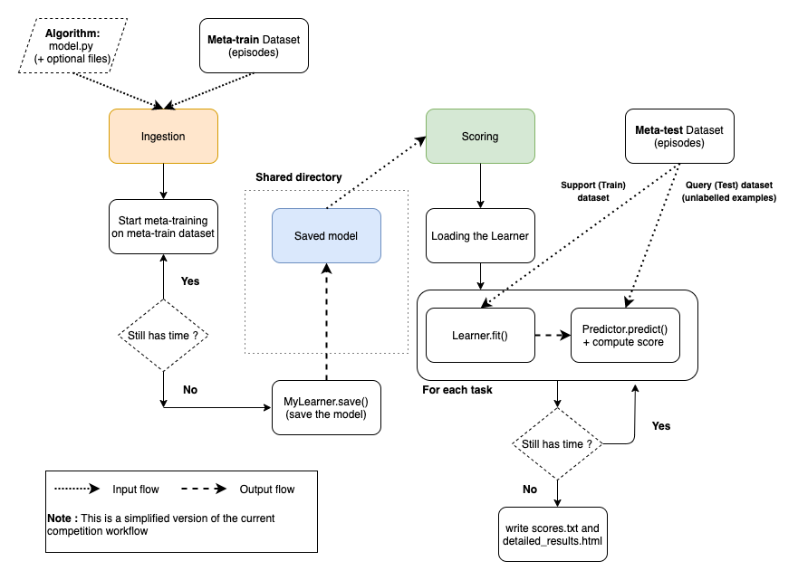

# Few-shot Learning competition starting kit

---
In this document, we present how to setup the tools to use the Jupyter Notebook tutorial. Also we present an overview of the challenge to understand how to write a valid code submission.

In this `README.md` file, you can find the following things : 
* Instructions to setup the environment to make the jupyter notebook ready to use
* An overview of the competition workflow  

In the **Jupyter Notebook** `tutorial.ipynb` you will learn the following things : 
* The format in which the data arrive to the meta-learning algorithm
* Familiarize with the challenge API and more specifically how to organize your code to write a valid submission.
---

<u>**Outline**</u>
* [Setup](#setup)
* [Understand how a submission is evaluated](#understand-how-a-submission-is-evaluated)
* [Prepare a ZIP file for submission on CodaLab](#prepare-a-zip-file-for-submission-on-codalab)
* [Troubleshooting](#troubleshooting)
* [Report bugs and create issues](#report-bugs-and-create-issues)
* [Contact us](#contact-us)

## Setup

### Download the starting kit
You should clone the whole **metadl** repository first. Make sure your git is setup and you have the necessary credentials. Then run the following command in the empty root directory of your project :
```
git clone git@github.com:$USERNAME/metadl.git
```

### Environment setup
**Note** : We assume that you have already installed anaconda on your device. If it's not the case, please check out the right installation guide for your machine in the following link : [conda installation guide](https://docs.conda.io/projects/conda/en/latest/user-guide/install/).

A script `quick_start.sh` is available and allows to quickly set up a conda environment with all the required modules/packages installed. 
Make sure you have cloned the metadl repository beforehand. 

Your root directory should look like the following : 
```
<root_directory>
|   metadl
```

Then, set your current working directory to be in metadl's starting kit folder using the following command :
```bash
cd metadl/starting_kit/
```

Then you can run the `quick_start.sh` script :
```bash
bash quick_start.sh
```
This script creates a Python 3.7 conda environment named **metadl**, install all packages/modules required, and notebook.
**Note**: During the execution, the terminal will ask you to confirm the installation of packages, make sure you accept.

Once everything is installed, you can now activate your environment with this command : 
```bash
conda activate metadl
```
And launch Jupyter notebook the following way : 

```bash
jupyter-notebook
```
You will access the Jupyter menu, click on `tutorial.ipynb` and you are all set.


### Update the starting kit

As new features and possible bug fixes will be constantly added to this starting kit, 
you are invited to get the latest updates before each usage by running:

```
cd <path_to_local_metadl>
git pull
```

If you forked the repository, here is how you update it : [syncing your fork](https://help.github.com/en/articles/syncing-a-fork)
### Public dataset
We provide a public dataset for participants. They can use it to :
* Explore data
* Do local test of their own algorithm

If you ran the `quick_start.sh` script, you should already have a new directory that contains the competition public data. This data is the Omniglot dataset that is divided into 2 file :
```
metadl
meta-dataset
omniglot
│   meta_train
│    │ 
│    │    0.tfrecords
│    │    1.tfrecords
│    │    ...
│    │    dataset_spec.json
│
│   meta_test 
│    │   
│    │    864.tfrecords
│    │    ...
│    │    dataset_spec.json

```
* omniglot/meta_train : Contains the classes and examples associated to the **meta-train dataset**
* omniglot/meta_test : Contains the classes and examples associated to the **meta-test dataset**

If you created your environment on your own, you can download the public data from the competition dashboard : 
[Public data](https://competitions.codalab.org/my/datasets/download/57327142-2155-4b37-9ee7-74820f56c812)


## Understand how a submission is evaluated 
First let's describe what scripts a partcipant should write to create a submission. They need to create the following files : 
* **model.py** (mandatory): contains the meta-learning algorithm procedure dispatched into the appropriate classes.

* **model.gin** (Optionnal) : If you are familiar with the [*gin* package](https://github.com/google/gin-config), you can use it to define 
the parameters of your model (e.g. learning rates, etc ...). This file could help organize your submission and keep track of the setups on which you defined you algorithm.

* **<any_file.py>** (Optionnal) : Sometimes you would need to create a specfic architecture of a neural net or any helper function for
your meta-learning procedure. You can include all the files you'd like but make sure you import them correctly in **model.py** as it is the only script executed.

An example of a submission using these files is described in the provided Jupyter notebook `tutorial.ipynb`.

The following figure explains the evaluation procedure of the challenge.



## Prepare a ZIP file for submission on CodaLab
Zip the contents of `baselines/zero`(or any folder containing your `model.py` file) without the directory structure:
```bash
cd ../baselines/zero
zip -r mysubmission.zip *
```
**Note** : The command above makes sense if you current working directory is `starting_kit`.

Then use the "Upload a Submission" button to make a submission to the
competition page on CodaLab platform.

Tip: to look at what's in your submission zip file without unzipping it, you
can do
```bash
unzip -l mysubmission.zip
```
## Troubleshooting

* It is highly recommended to use the previous guidelines to prepare a zip file submission insteand of simply compressing the code folder in the *Finder* (for MAC users).
* Make sure your submission always write a file in the Learner's `save()` method. Otherwise, the submission will fail and CodaLab will return the following error during the **scoring** phase : `ModuleNotFoundError: No module named 'model'`.

## Report bugs and create issues 

If you run into bugs or issues when using this starting kit, please create issues on the [*Issues* page](https://github.com/ebadrian/metadl/issues) of this repo. 

## Contact us 
If you have any questions, please contact us via : 
<eb.adrian@hotmail.fr>
